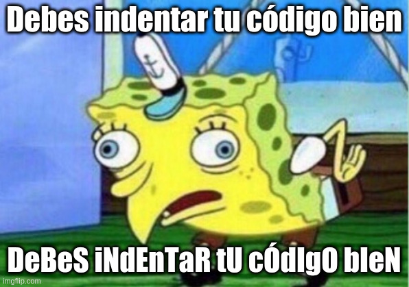

---
difficulty:
  - beginner
OAs:
  - string manipulation
  - loops
projects:
  - cipher
  - card-validation
---

# sPoNgEbOb MeMe



[https://www.codewars.com/kata/5982619d2671576e90000017](https://www.codewars.com/kata/5982619d2671576e90000017)

¿Recuerdas el meme de Bob Esponja que pretende burlarse de las personas repitiendo 
lo que dicen de manera burlona?

Debe crear una función que convierta la entrada a este formato, con la 
salida siendo la misma cadena, excepto que hay un patrón de letras mayúsculas y 
minúsculas.

```js
spongeMeme('stop Making spongebob Memes!'); // => 'StOp mAkInG SpOnGeBoB MeMeS!'
spongeMeme('colored teens cant Be successful in tech'); // =>'CoLoReD TeEnS CaNt bE SuCcEsSfUl iN TeCh'
```